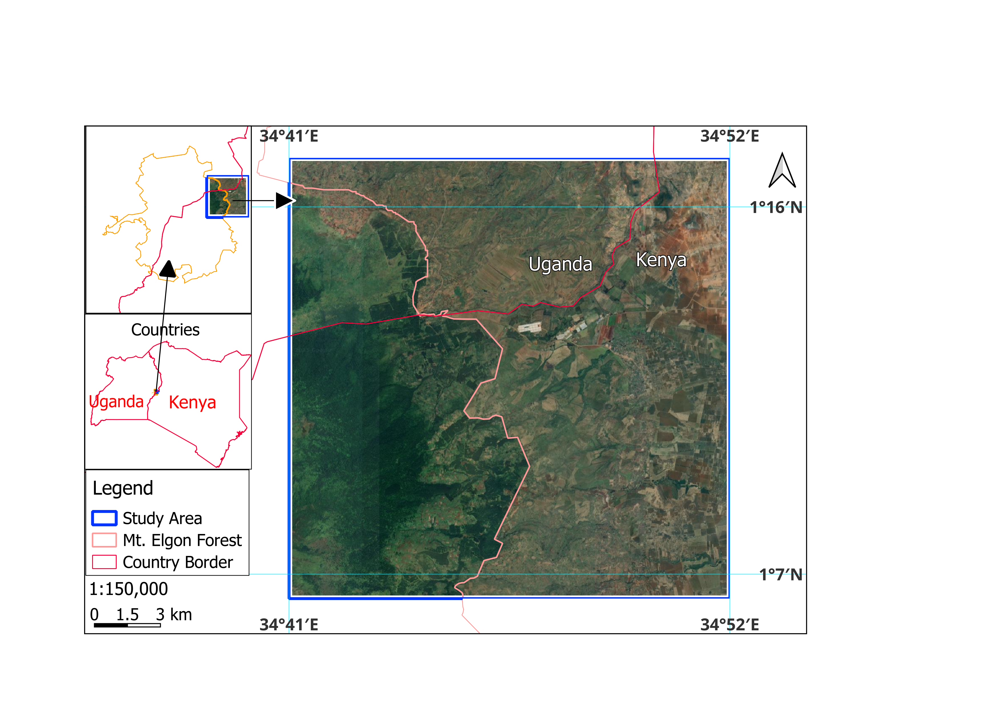
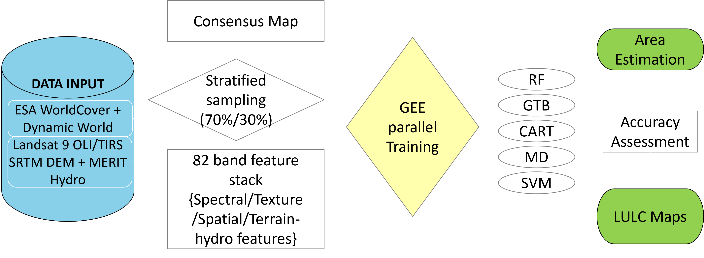
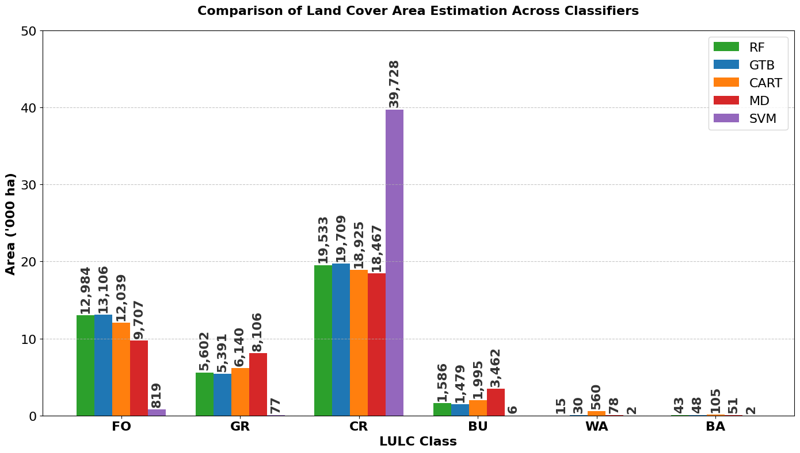
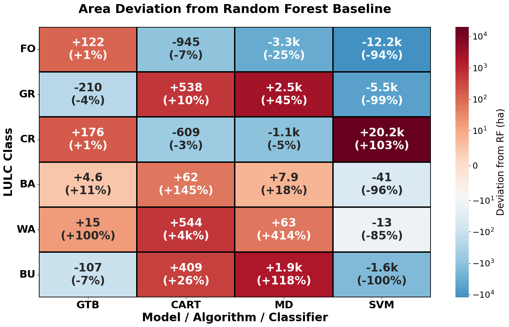

# Evaluating Classification Accuracy, Area Estimation, and Area Deviations of Five Algorithms in Google Earth Engine
### Suam LULC Analysis 2025: Comparative Machine Learning Performance

## 1. Project Overview
This repository hosts the source code and datasets for the comparative analysis of five supervised machine learning algorithms: **Random Forest (RF)**, **Gradient Tree Boost (GTB)**, **Classification and Regression Trees (CART)**, **Minimum Distance (MD)**, and **Support Vector Machines (SVM)**. 

The study assesses classifier stability and area estimation accuracy in the heterogeneous tropical landscape of the Suam region (Mt. Elgon), along the Kenyan-Ugandan border.

## 1. Abstract
Land use land cover (LULC) classification accuracy is essential in ensuring reliable evidenced-based environmental monitoring and policy making, especially within protected transboundary areas. This study evaluates the performance of five machine learning algorithms and their area estimation differences in the Suam region (40,000 ha) located near Mt. Elgon forest along the Kenyan-Ugandan border. 

Utilizing an 82-band feature stack (spectral, texture, and terrain metrics) and 863 consensus-derived training samples, we generated LULC maps in Google Earth Engine (GEE). Results showed that **Random Forest (RF)** achieved the highest OA (93.4%) and mF1 (0.922). Conversely, **SVM** exhibited serious instability, leading to model collapse and heavily inflated cropland estimates. This research highlights the critical role of classifier choice in creating credible LULC maps for planning and management in heterogeneous tropical landscapes.

**Keywords:** Machine Learning, Google Earth Engine, Mt. Elgon Forest, LULC, Accuracy assessment, Policy.

---

## 2. Study Area
The research area covers a **20 km × 20 km (40,000 ha)** site on the slopes of **Mount Elgon**. 
* **Geography:** Transboundary forest transition zone between Kenya and Uganda.
* **Topography:** Elevation ranges from **1700 m to 3300 m** a.s.l.
* **Ecosystems:** High heterogeneity featuring protected forests, riparian ecosystems of the Suam River, agricultural lands, and built-up areas.

*Figure 1: Study area location (Suam, Mt. Elgon) and topographic context.*

---

## 3. Methodology & Data

### Data Inputs:
* **Satellite:** Cloud-free 2025 Landsat 9 (Collection 2 Level 2) median composite.
* **Terrain/Hydro:** SRTM DEM and MERIT Hydro datasets.
* **Feature Stack:** An **82-band hypercube** (30 spectral metrics, 40 spectral indices, 6 texture bands, and 6 terrain/hydro features).

### Classification Framework:
1. **Sample Generation:** Automated stratified random sampling (**863 training samples**). 
   * *Table 1: LULC classes description and training samples distribution (Refer to paper).*
### Table 1. LULC classes description and training samples distribution.

| LULC class | Description | Total Samples (100%) | Training Set (70%) | Validation Set (30%) |
| :--- | :--- | :--- | :--- | :--- |
| FO | Area covered by trees (<2 m) | 300 | 210 | 90 |
| GR | Includes grassland and shrublands with trees | 100 | 70 | 30 |
| CR | Small- and large-scale agricultural areas | 300 | 210 | 90 |
| BA | Areas with a vegetation cover (> 10%) | 28 | 20 | 8 |
| WA | All water bodies including rivers and lakes | 35 | 24 | 11 |
| BU | All areas that are built-up | 100 | 70 | 30 |
| **TOTAL** | | **863** | **604** | **259** |

2. **Algorithms:** RF, GTB (GBM), CART, MD, and SVM.
3. **Metrics:** OA, Kappa, mF1, Quantity Disagreement (QD), and Allocation Disagreement (AD).

*Figure 2: Methodological workflow for LULC classification and area deviation analysis.*

---

## 4. Key Results & Visualizations

### Performance Metrics
*Table 2: Accuracy and Disagreement Metrics across Classifiers (RF leads with 93.4% OA).*

### Area Estimation and Deviations
The choice of classifier significantly impacts the reported area of critical land covers, which has direct implications for transboundary policy.

*Figure 3: Land cover area estimation by each classifier.*

*Figure 4: Area estimation deviations relative to RF baseline. Blue indicates overestimation, while dark brown indicates underestimation. Values in 'k' denote thousands of ha.*

---

## 5. Repository Structure
* **`/scripts`**: 
    * `analysis_gee.js`: GEE JavaScript code for feature engineering and classifier execution.
    * `visualizations_SUAM.ipynb`: Python notebook for generating error matrices, area estimations, and deviation plots.
* **`/data`**: 
    * `training_samples_863.csv`: The validated training dataset derived from ESA/Dynamic World consensus.

---

## 6. Reproduction
1. **GEE Script:** Access the [Interactive Snapshot]([https://code.earthengine.google.com/9cd46be3da82dc9030a23ac2e354f5ab])(https://code.earthengine.google.com/c517cd83def3761a11f592ebda6dc966).
2. **Python Analysis:** Run the notebook in `/scripts` to reproduce the accuracy assessment and Figure 4 deviations.

## 7. Citation & License
If you utilize this code or data, please cite:
> *[Full citation for CP_3 - To be updated upon publication]*

Licensed under the **MIT License**.
